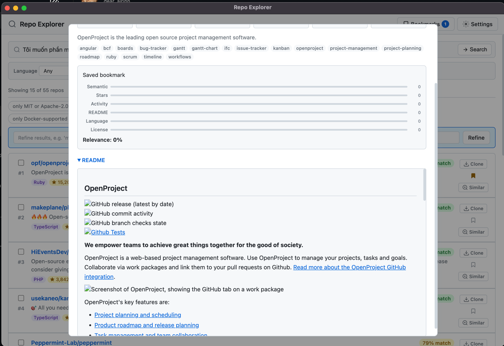

# Repo Explorer



Discover GitHub repositories using natural-language descriptions via a local LLM (Ollama).

Type what you need — "I want a self-hosted CI/CD platform with Docker support" — and the app uses a local LLM to understand your intent, search GitHub, and rank the best matches with explanations.

## Tech Stack

| Layer | Technology |
|-------|-----------|
| Desktop Shell | Electron 34 |
| Frontend | React 18 + TypeScript |
| Build | Vite (renderer) + esbuild (main) |
| LLM Runtime | Ollama (local) |
| GitHub | REST API (authenticated) |
| Testing | Vitest |
| Packaging | electron-builder (NSIS installer / DMG) |

**Why Electron over Tauri?** Single language (TypeScript) across main + renderer, mature ecosystem, no Rust toolchain required, and electron-builder produces polished installers for both platforms out of the box.

## Prerequisites

- [Node.js](https://nodejs.org/) 20+ (v24.15.0 recommended)
- [Ollama](https://ollama.com/) installed and running locally
- At least one Ollama model pulled (e.g., `ollama pull llama3.2`)
- A [GitHub Personal Access Token](https://github.com/settings/tokens) (classic token with `repo` and `read:user` scopes)

## Quick Start

```bash
# Clone & enter the repo
cd repo-explorer

# Install dependencies
npm install

# Start in development mode
npm run dev
```

The app window opens automatically. Configure your GitHub token and Ollama URL in Settings (gear icon, top-right), then type a search query.

## Features

- **Multi-query search** — Ollama generates 3 alternative keyword queries from your description, run as parallel GitHub searches with automatic deduplication
- **Iterative refinement** — Refine results inline (e.g. "more DevOps focused", "prefer Go") to re-rank cached repos without re-hitting GitHub
- **Lazy explanations** — Match explanations generated on demand when viewing repo details, keeping search fast
- **Weighted ranking** — 6-signal relevance scoring with adjustable emphasis per refinement
- **Bookmarks** — Save repositories to a persistent bookmark list for later reference; view, revisit, or remove saved repos anytime
- **Repo comparison** — Select two or more repos and compare them side-by-side across stars, forks, language, license, topics, and match explanation
- **One-click clone** — Clone any repository to your local machine directly from the app, with a file-picker dialog to choose the destination
- **Copy clone command** — Copy the full `git clone` command to clipboard for any repository
- **Find similar** — Use any result as a seed to search for similar repositories
- **Theme support** — Choose between light, dark, or system-following theme in Settings

## How It Works

1. **You type a description** — natural language, no special syntax
2. **Ollama extracts structured criteria** — 3 keyword query variations, technologies, intent, license preferences
3. **Parallel GitHub searches** — all 3 queries run simultaneously, results merged and deduplicated by repo ID
4. **READMEs are fetched** — for top candidates by stars
5. **Ranking engine scores each result** — combining 6 signals (weights adjustable via refinement):
   - Semantic keyword/topic match (30%)
   - Stars (20%)
   - Recency of activity (15%)
   - README relevance (15%)
   - Language/framework match (10%)
   - License compatibility (10%)
6. **Results are displayed** — ranked cards with score badges; click for on-demand match explanation and breakdown

## Scripts

| Command | Description |
|---------|-------------|
| `npm run dev` | Start dev mode (hot-reload renderer, restart on main changes) |
| `npm run build` | Build renderer + main process for production |
| `npm run test` | Run unit tests |
| `npm run test:watch` | Unit tests in watch mode |
| `npm run test:integration` | Run integration tests (uses mocks by default) |
| `npm run test:all` | Run all tests (unit + integration) |
| `npm run package:win` | Package as Windows NSIS installer → `release/` |
| `npm run package:mac` | Package as macOS DMG → `release/` |
| `npm run package:all` | Package for both platforms |
| `npm run lint` | Type-check all TypeScript files |

## Building Releases

### Windows (.exe)

```bash
npm run package:win
```

Produces `release/Repo Explorer-1.0.0-setup.exe` (NSIS installer, ~80 MB).

### macOS (.app / .dmg)

Must be run on a Mac — electron-builder cannot cross-compile macOS binaries from Windows or Linux.

```bash
npm run package:mac
```

Produces `release/Repo Explorer-1.0.0.dmg`.

### Custom App Icon

Drop your icon files into the `build/` directory before packaging:

| Platform | File | Format |
|----------|------|--------|
| Windows | `build/icon.ico` | ICO, 256×256 |
| macOS | `build/icon.icns` | ICNS |

Without these, the default Electron icon is used.

## Running Tests

```bash
# Unit tests (fast, no external services needed)
npm run test

# Integration tests with mocks (default)
npm run test:integration

# Live integration tests (requires working Ollama + GitHub token)
$env:RUN_INTEGRATION_TESTS = "true"
$env:OLLAMA_TEST_URL = "http://localhost:11434"
$env:GITHUB_TEST_TOKEN = "ghp_your_token_here"
npm run test:integration

# All tests together
npm run test:all
```

## Project Structure

```
repo-explorer/
├── src/
│   ├── main/                    # Electron main process
│   │   ├── index.ts             # App entry, window creation
│   │   ├── ipc-handlers.ts      # IPC bridge (frontend ↔ backend)
│   │   ├── ollama/client.ts     # Ollama HTTP client
│   │   ├── github/client.ts     # GitHub REST API client
│   │   ├── search/query-gen.ts  # LLM query extraction & generation
│   │   ├── ranking/engine.ts    # Multi-signal relevance scoring
│   │   ├── bookmarks/store.ts   # JSON bookmark persistence
│   │   └── settings/store.ts    # JSON settings persistence
│   ├── renderer/                # React frontend
│   │   ├── App.tsx              # Root component
│   │   ├── main.tsx             # React entry point
│   │   ├── components/          # UI components
│   │   │   ├── SearchBar.tsx    # Natural-language input
│   │   │   ├── ResultCard.tsx   # Repository result card
│   │   │   ├── RepoDetail.tsx   # Full detail modal
│   │   │   ├── Settings.tsx     # Settings panel
│   │   │   ├── StatusBar.tsx    # Connection status
│   │   │   ├── Filters.tsx      # Language/license/stars filters
│   │   │   ├── MatchExplanation.tsx  # Score breakdown visualization
│   │   │   ├── BookmarkButton.tsx    # Toggle bookmark on a result
│   │   │   ├── BookmarksPanel.tsx    # Bookmark list & management
│   │   │   ├── CloneButton.tsx       # Clone repo to local machine
│   │   │   ├── CopyButton.tsx        # Copy git clone command
│   │   │   └── ComparisonView.tsx    # Side-by-side repo comparison
│   │   ├── hooks/               # React hooks
│   │   │   ├── useSettings.ts
│   │   │   ├── useOllama.ts
│   │   │   ├── useSearch.ts
│   │   │   └── useBookmarks.ts
│   │   ├── types/index.ts       # Renderer-side type declarations
│   │   └── styles/app.css       # Theme stylesheet
│   ├── preload/index.ts         # Context bridge (secure IPC)
│   └── shared/types.ts          # Shared TypeScript types & IPC channel defs
├── tests/
│   ├── mocks/                   # Test doubles
│   │   ├── ollama.ts
│   │   └── github.ts
│   ├── unit/                    # 22 test cases total
│   │   ├── ranking.test.ts      # Ranking engine (9 cases)
│   │   ├── query-gen.test.ts    # Query extraction & search params (8 cases)
│   │   └── bookmarks.test.ts    # Bookmark store logic (5 cases)
│   └── integration/             # 46 test cases total
│       ├── ollama.test.ts       # Ollama connection + generation (5 cases)
│       ├── github.test.ts       # GitHub auth + search + README (7 cases)
│       ├── query-gen.test.ts    # Query extraction + param building (9 cases)
│       ├── e2e.test.ts          # Full pipeline + multi-query + refinement (12 cases)
│       └── error-handling.test.ts  # Error scenarios (13 cases)
├── scripts/
│   └── build-main.mjs           # esbuild config for main + preload
├── package.json                 # Dependencies, scripts, electron-builder config
├── tsconfig.json                # Base TypeScript config
├── tsconfig.main.json           # Main process TS config
├── tsconfig.renderer.json       # Renderer TS config
├── vite.config.ts               # Vite config for renderer
├── vitest.config.ts             # Unit test config
└── vitest.integration.config.ts # Integration test config
```

## Installing on Windows

1. Download `Repo Explorer-1.0.0-setup.exe` from the release
2. Run the installer (NSIS)
3. Click through the wizard — installs to `%LOCALAPPDATA%\Repo Explorer`
4. Launch from Start Menu or desktop shortcut

## Installing on macOS

1. Download `Repo Explorer-1.0.0.dmg` from the release
2. Open the DMG and drag `Repo Explorer.app` to `/Applications`
3. First launch: right-click → Open (to bypass Gatekeeper for unsigned apps)

## Error Handling

The app handles these failure modes:

- **Ollama not installed/not running** — Status bar shows "Disconnected", search is disabled
- **Invalid GitHub token** — Status bar shows "Invalid token", Settings shows error message
- **GitHub rate limit** — Clear error message with reset time, suggests adding a token
- **Empty results** — "No results" state with suggestion to broaden search
- **LLM malformed output** — Falls back to raw keyword extraction, shows partial results
- **Network failures** — Retryable error shown, connection status updated
- **Partial query failure** — If some parallel search queries fail, results from successful queries are still shown
- **Search superseded** — In-flight searches are cancelled when a new search starts

## Future Improvements

- **Caching**: Cache GitHub search results and READMEs to reduce API calls
- **Streaming**: Stream Ollama responses for real-time UI updates during search
- **History**: Save and revisit past searches
- **Offline mode**: Search previously fetched results without network
- **Model download UI**: Pull Ollama models from within the app
- **Repository insights**: Show commit frequency, contributor count, release cadence
