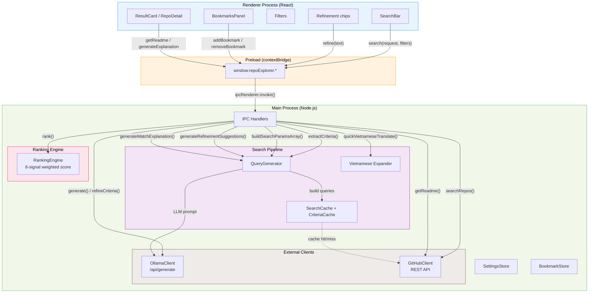

# Repo Explorer

Discover GitHub repositories using natural-language descriptions via a local LLM (Ollama).

Type what you need — "I want a self-hosted CI/CD platform with Docker support" — and the app uses a local LLM to understand your intent, search GitHub, and rank the best matches with explanations.

## Tech Stack

| Layer | Technology |
|-------|------------|
| Desktop Shell | Electron 34 |
| Frontend | React 18 + TypeScript |
| Markdown Rendering | marked |
| Build | Vite (renderer) + esbuild (main) |
| LLM Runtime | Ollama (local) |
| GitHub | REST API (authenticated) |
| Testing | Vitest |
| Packaging | electron-builder (NSIS installer / DMG) |

**Why Electron over Tauri?** Single language (TypeScript) across main + renderer, mature ecosystem, no Rust toolchain required, and electron-builder produces polished installers for both platforms out of the box.

## Prerequisites

- [Node.js](https://nodejs.org/) 20+ (v24.15.0 recommended)
- [Ollama](https://ollama.com/) installed and running locally
- At least one Ollama model pulled (e.g., `ollama pull llama3.2`)
- A [GitHub Personal Access Token](https://github.com/settings/tokens) (classic token with `repo` and `read:user` scopes)

## Quick Start

```bash
# Clone & enter the repo
cd repo-explorer

# Install dependencies
npm install

# Start in development mode
npm run dev
```

The app window opens automatically. Configure your GitHub token and Ollama URL in Settings (gear icon, top-right), then type a search query.

## Features

- **Multi-query search** — Ollama generates 3 alternative keyword queries from your description, run as parallel GitHub searches with automatic deduplication
- **Vietnamese search** — Vietnamese queries are detected, translated, and enriched with synonym expansion and diacritics-stripped variants for broad recall on GitHub's English-dominant index
- **Smart fast path** — simple/atomic queries (e.g. `docker`, `react`) skip the LLM entirely and go straight to GitHub search
- **Iterative refinement** — Refine results inline (e.g. "more DevOps focused", "prefer Go", "sort by stars") to re-rank cached repos without re-hitting GitHub; deterministic refinements (sort, emphasis) skip the LLM entirely
- **Lazy explanations** — Match explanations generated on demand when viewing repo details, keeping search fast
- **Weighted ranking** — 6-signal relevance scoring with adjustable emphasis per refinement
- **Bookmarks** — Save repositories to a persistent bookmark list for later reference; view, revisit, or remove saved repos anytime
- **One-click clone** — Clone any repository to your local machine directly from the app, with a file-picker dialog to choose the destination
- **Copy clone command** — Copy the full `git clone` command to clipboard for any repository
- **Find similar** — Use any result as a seed to search for similar repositories
- **Infinite scroll** — Automatically loads more results as you scroll; serves from in-memory cache first, then fetches from GitHub
- **Theme support** — Choose between light, dark, or system-following theme in Settings

## How It Works

1. **You type a description** — natural language, no special syntax (supports English and Vietnamese)
2. **Fast keyword extraction** — stop-word removal and compound-term detection produce an instant GitHub query; for known tech names (e.g. `docker`, `react`) the LLM is skipped entirely
3. **LLM enriches the query** — Ollama generates 3 alternative keyword queries, plus technologies, intent, and license preferences; Vietnamese queries get additional deterministic enrichment (dictionary translation, synonym expansion, diacritics-stripped variants)
4. **Parallel GitHub searches** — all queries deduplicated by Jaccard similarity (≥50% overlap for search queries, ≥33% for suggestions), then run simultaneously with bounded concurrency; results merged and deduplicated by repo ID
5. **READMEs are prefetched** — for top 20 candidates by stars, with a 30-minute shared cache
6. **Ranking engine scores each result** — combining 6 signals (weights adjustable via refinement):
   - Semantic keyword/topic match (30%)
   - Stars (20%)
   - Recency of activity (15%)
   - README relevance (15%)
   - Language/framework match (10%)
   - License compatibility (10%)
7. **Results are displayed** — ranked cards with score badges; click for on-demand match explanation and breakdown
8. **Suggestions appear async** — refinement chips generated from result statistics (language/license distribution, score spread, negative-space gaps)

## Project Architecture

### Overview

Repo Explorer is an Electron app with a clear main/renderer separation. All search logic, LLM calls, and GitHub API access live in the **main process** (Node.js). The **renderer** (React) sends user actions via IPC and receives results back — it never calls external APIs directly. A **preload script** bridges the two with a `contextBridge` API.

### Architecture Diagram



### End-to-End Data Flow

#### 1. User Input → Fast-Path Keyword Search (Phase 1)

```
User types query  ──►  SearchBar  ──►  IPC: search(request, filters)
                                                   │
                                                   ▼
                                          IPC Handler (main process)
                                                   │
                                    ┌──────────────┴──────────────┐
                                    │  Is it a simple/atomic query?│
                                    │  (e.g. "docker", "react")   │
                                    └──────┬──────────────┬───────┘
                                           │ Yes          │ No
                                           ▼              ▼
                                    Skip LLM       Vietnamese detection
                                    extractFast     quickVietnameseTranslate()
                                    Keywords()            │
                                           │          (if needed)
                                           ▼              │
                                    GitHub search ◄────────┘
                                    (1 query, cached)
                                           │
                                           ▼
                                    Rank results ──► Return top 10
```

- **Simple queries** (known tech names like `docker`, `react`) skip the LLM entirely — they go straight to GitHub search with keyword extraction and return immediately.
- **Vietnamese queries** get a local dictionary translation before the fast keyword search, so Phase 1 isn't blocked waiting for the LLM.
- The `SearchCache` (TTL 15 min, LRU 100 entries) avoids redundant GitHub API calls for identical queries.

#### 2. LLM Enrichment (Phase 2 — runs inline, unified response)

```
User request ──►  OllamaClient.generate()
                        │
                        ▼
            QueryGenerator.extractCriteria()
                        │
          ┌─────────────┼─────────────┐
          ▼             ▼             ▼
    searchQueries   technologies   intent
    [q1, q2, q3]   [Go, Docker]   devops-tool
                        │
                        ▼
     Vietnamese expansion (if detected)
     ─ extractTechTerms(), expandGithubSynonyms()
     ─ deterministic intent classification
     ─ diacritics-stripped variant queries
                        │
                        ▼
      buildSearchParamsArray(criteria)
           │            │            │
           ▼            ▼            ▼
      query: q1     query: q2     query: q3
      (+ VN variants, compound queries)
           │            │            │
           ▼            ▼            ▼
      deduplicateSimilarQueries()
                        │
                        ▼
         Parallel GitHub searches (boundedAllSettled)
         concurrency: 5 (auth) or 3 (unauth)
                        │
                        ▼
         Merge & deduplicate by repo ID
```

- The LLM produces **3 keyword query variations** plus metadata (technologies, intent, license preference).
- Vietnamese queries get **deterministic enrichment**: local tech-term extraction, synonym expansion, diacritics-stripped search variants — no extra LLM calls.
- Search queries are **deduplicated** by Jaccard similarity (≥50% overlap for search queries, ≥33% for suggestions) before firing GitHub API calls.
- Phase 1 and Phase 2 now run as a **unified search** — the handler awaits LLM enrichment, merges all results (fast-path + LLM queries), and returns enriched results in a single response. The renderer shows a loading spinner until results are ready.
- The `CriteriaCache` (TTL 30 min) caches LLM-extracted criteria for identical queries.

#### 3. README Prefetch + Ranking

```
Merged repos (deduplicated)
        │
        ▼
Sort by stars ──► Take top 20
        │
        ▼
Parallel README fetch (top 20 by stars)
  github.getReadme() × 20   ──►  30-min static cache
        │                           (shared across client instances)
        ▼
  RankingEngine.rank(repos, criteria, readmes, userRequest, topK=50)
        │
        ├──► scoreRepo() for each candidate:
        │      │
        │      ├── Semantic keyword/topic match (30%)
        │      │     token matching in name, description, topics
        │      │     + intent-topic cluster alignment
        │      │     + Vietnamese/expanded keyword matching
        │      │     + useCase sub-phrase matching
        │      │     + soft saturation (score / (1 + score))
        │      │
        │      ├── Stars (20%) ── log₁₀(stars) / 5
        │      ├── Recency (15%) ── 1 - monthsAgo/36
        │      ├── README relevance (15%) ── keyword hits in README
        │      ├── Language match (10%) ── exact or partial match
        │      └── License compatibility (10%) ── exact or permissive match
        │
        │   (all weights adjustable via refinement emphasis)
        │
        ▼
  Top-K via min-heap (O(n log k)) ──► Return top 50, serve first 10
```

- READMEs are prefetched only for the **top 20 candidates by stars** — this is the main API cost driver. The 30-minute shared cache prevents re-fetching.
- Ranking uses a **min-heap top-K algorithm** for efficiency — O(n log k) instead of full sort.
- **Credibility penalty**: repos with <100 stars get 40% semantic-match discount; 100–499 stars get 15% discount.
- **Refinement** can re-rank the same cached repos with adjusted weights — no new API calls needed.

#### 4. Suggestions + Refinement Loop

```
Ranked results
      │
      ▼
  generateRefinementSuggestions()  ──►  Ollama (fire-and-forget)
      │                                       │
      │   Result statistics ─────────────────┘
      │   (language/license/star distribution,
      │    negative-space gaps, score percentiles)
      │
      ▼
  deduplicateBatch() + guaranteeCoverage()
      │
      ▼
  IPC: SUGGESTIONS_UPDATE  ──►  Renderer shows refinement chips
                                           │
                                    User clicks chip ("only Go projects")
                                           │
                                           ▼
                                    IPC: SEARCH_REFINE(text)
                                           │
                              ┌─────────────┴─────────────┐
                              │                           │
                        Deterministic?               Needs LLM?
                        (sort/emphasis)               │
                              │                       ▼
                              │              refineCriteria() ──► Ollama
                              │                       │
                              ▼                       ▼
                        Re-rank cached repos with adjusted criteria/weights
                              │
                              ▼
                        Return re-ranked results (no GitHub API calls)
```

- Suggestion generation is **async and fire-and-forget** — it never blocks or delays the main results.
- **Deterministic refinements** (sort by stars/forks/recency, weight emphasis like "more DevOps focused") skip the LLM entirely — instant re-ranking from cache.
- The **RefinementParser** detects patterns like "sort by stars", "only Go", "prefer active" and maps them to weight adjustments without calling Ollama.

#### 5. Pagination + Lazy Details

```
User scrolls to bottom ──► IPC: SEARCH_MORE
      │
      ├── Cache has unserved repos? ──► Return next 10 from memory (instant)
      │
      └── Cache exhausted? ──► Fetch next page from GitHub API
                                    │
                                    ▼
                              Rank new page results + append

User clicks a repo card ──► RepoDetail opens ──► IPC: GET_README
                                                          │
                                                          ▼
                                              GitHub README fetch (cached)

User clicks "Why this match?" ──► IPC: GENERATE_EXPLANATION
                                          │
                                          ▼
                                  Ollama generates 1-2 sentence explanation
```

- **Pagination** first serves from the in-memory ranked cache (instant), only hitting GitHub when the cache is exhausted.
- **READMEs** and **match explanations** are loaded lazily on demand — they're never fetched until the user actually opens a detail view.

### Component Responsibilities

| Component | File | Role |
|-----------|------|------|
| **OllamaClient** | `src/main/ollama/client.ts` | HTTP client for Ollama `/api/generate` and `/api/tags`. Connection check, model listing, text generation. |
| **GitHubClient** | `src/main/github/client.ts` | Authenticated GitHub REST API client. Repo search, README fetch with 5xx retry, static README cache (shared across instances). |
| **QueryGenerator** | `src/main/search/query-gen.ts` | LLM-powered criteria extraction, query generation, refinement, and suggestion generation. Vietnamese expansion pipeline. |
| **RankingEngine** | `src/main/ranking/engine.ts` | 6-signal weighted relevance scoring with min-heap top-K. Adjustable weights via `WeightEmphasis`. |
| **SearchCache** | `src/main/search/cache.ts` | TTL + LRU cache for GitHub search results (15 min) and LLM criteria (30 min). Metrics tracking. |
| **PerformanceTracker** | `src/main/search/perf.ts` | Phase-level timing for search pipeline (ollama, github, ranking, readme) with cache metric aggregation. |
| **Vietnamese Expander** | `src/main/search/vietnamese.ts` | Vietnamese detection, dictionary translation, tech-term extraction, synonym expansion, diacritics normalization. |
| **RefinementParser** | `src/main/search/refinement-parser.ts` | Deterministic refinement detection (sort/emphasis patterns) — skips LLM when possible. |
| **IPC Handlers** | `src/main/ipc-handlers.ts` | Central orchestrator. Handles search pipeline, refinement, pagination, lazy details, bookmarks, clone. Abort controllers for search supersession. Unified Phase 1+2 search (awaits LLM enrichment before returning results). |
| **Preload** | `src/preload/index.ts` | `contextBridge` API — exposes `search()`, `refine()`, `searchMore()`, `getReadme()`, etc. to the renderer. |
| **useSearch hook** | `src/renderer/hooks/useSearch.ts` | React state management for search. Tracks results, loading, paginating, applied refinements. Deduplicates suggestion chips. |

### Caching Strategy

| Cache | Location | TTL | Max Size | Eviction |
|-------|----------|-----|----------|----------|
| Search results | `SearchCache` (main process) | 15 min | 100 entries | LRU + expired-first |
| LLM criteria | `CriteriaCache` (main process) | 30 min | 100 entries | LRU + expired-first |
| Vietnamese translations | `VietnameseTranslationCache` (main process) | 30 min | 200 entries | LRU + expired-first |
| README content | `GitHubClient.readmeCache` (static) | 30 min | unbounded | TTL expiry only |
| Bookmarks | `BookmarkStore` (disk) | persistent | unbounded | N/A |
| Settings | `SettingsStore` (disk) | persistent | N/A | N/A |

## Scripts

| Command | Description |
|---------|-------------|
| `npm run dev` | Start dev mode (hot-reload renderer, restart on main changes) |
| `npm run build` | Build renderer + main process for production |
| `npm run test` | Run unit tests |
| `npm run test:watch` | Unit tests in watch mode |
| `npm run test:integration` | Run integration tests (uses mocks by default) |
| `npm run test:all` | Run all tests (unit + integration) |
| `npm run package:win` | Package as Windows NSIS installer → `release/` |
| `npm run package:mac` | Package as macOS DMG → `release/` |
| `npm run package:all` | Package for both platforms |
| `npm run lint` | Type-check all TypeScript files |

## Building Releases

### Windows (.exe)

```bash
npm run package:win
```

Produces `release/Repo Explorer-1.0.1-setup.exe` (NSIS installer, ~80 MB).

### macOS (.app / .dmg)

Must be run on a Mac — electron-builder cannot cross-compile macOS binaries from Windows or Linux.

```bash
npm run package:mac
```

Produces `release/Repo Explorer-1.0.1.dmg`.

### Custom App Icon

Drop your icon files into the `build/` directory before packaging:

| Platform | File | Format |
|----------|------|--------|
| Windows | `build/icon.ico` | ICO, 256×256 |
| macOS | `build/icon.icns` | ICNS |

Without these, the default Electron icon is used.

## Running Tests

```bash
# Unit tests (fast, no external services needed)
npm run test

# Integration tests with mocks (default)
npm run test:integration

# Live integration tests (requires working Ollama + GitHub token)
$env:RUN_INTEGRATION_TESTS = "true"
$env:OLLAMA_TEST_URL = "http://localhost:11434"
$env:GITHUB_TEST_TOKEN = "ghp_your_token_here"
npm run test:integration

# All tests together
npm run test:all
```

## Project Structure

```
repo-explorer/
├── src/
│   ├── main/                    # Electron main process
│   │   ├── index.ts             # App entry, window creation
│   │   ├── ipc-handlers.ts      # IPC bridge (frontend ↔ backend), search orchestrator
│   │   ├── ollama/client.ts     # Ollama HTTP client (generate, models, connection check)
│   │   ├── github/client.ts     # GitHub REST API client (search, README, token check)
│   │   ├── search/              # Search pipeline
│   │   │   ├── query-gen.ts     # LLM query extraction, refinement, suggestions
│   │   │   ├── cache.ts         # TTL + LRU caches for search results & criteria
│   │   │   ├── perf.ts          # Search pipeline performance tracking
│   │   │   ├── vietnamese.ts    # Vietnamese detection, translation, synonym expansion
│   │   │   ├── refinement-parser.ts    # Deterministic refinement detection (sort/emphasis)
│   │   │   ├── refinement-validator.ts # LLM suggestion validation & dedup
│   │   │   └── result-stats.ts  # Result set statistics & negative-space mining
│   │   ├── ranking/engine.ts    # Multi-signal relevance scoring (6 signals, min-heap top-K)
│   │   ├── bookmarks/store.ts   # JSON bookmark persistence
│   │   ├── settings/store.ts    # JSON settings persistence
│   │   └── utils/concurrency.ts # Bounded concurrency & GitHub rate-limit helpers
│   ├── renderer/                # React frontend
│   │   ├── App.tsx              # Root component
│   │   ├── main.tsx             # React entry point
│   │   ├── components/          # UI components
│   │   │   ├── SearchBar.tsx    # Natural-language input
│   │   │   ├── ResultCard.tsx   # Repository result card (bookmark, find similar, clone)
│   │   │   ├── RepoDetail.tsx   # Full detail modal (README, explanation, clone)
│   │   │   ├── Settings.tsx     # Settings panel (GitHub token, Ollama URL, model, theme)
│   │   │   ├── StatusBar.tsx    # Connection status (Ollama + GitHub)
│   │   │   ├── Filters.tsx      # Language/license/stars filters
│   │   │   ├── MatchExplanation.tsx  # Score breakdown visualization
│   │   │   ├── BookmarkButton.tsx    # Toggle bookmark on a result
│   │   │   ├── BookmarksPanel.tsx    # Bookmark list & management
│   │   │   ├── CloneButton.tsx       # Clone repo to local machine
│   │   │   └── CopyButton.tsx        # Copy git clone command
│   │   ├── hooks/               # React hooks
│   │   │   ├── useSettings.ts
│   │   │   ├── useOllama.ts
│   │   │   ├── useSearch.ts
│   │   │   └── useBookmarks.ts
│   │   ├── types/index.ts       # Renderer-side type declarations
│   │   └── styles/app.css       # Theme stylesheet
│   ├── preload/index.ts         # Context bridge (secure IPC API)
│   └── shared/types.ts          # Shared TypeScript types & IPC channel defs
├── tests/
│   ├── mocks/                   # Test doubles
│   │   ├── ollama.ts
│   │   └── github.ts
│   ├── unit/                    # 351 test cases
│   │   ├── ranking.test.ts      # Ranking engine (29 cases)
│   │   ├── query-gen.test.ts    # Query extraction & search params (12 cases)
│   │   ├── vietnamese.test.ts   # Vietnamese detection, translation, synonyms (225 cases)
│   │   ├── refinement-parser.test.ts  # Deterministic refinement detection (24 cases)
│   │   ├── refinement-validator.test.ts # Suggestion validation (10 cases)
│   │   ├── refinement-dedup.test.ts   # Batch dedup logic (10 cases)
│   │   ├── negative-space.test.ts     # Negative-space gap mining (12 cases)
│   │   ├── result-stats.test.ts       # Result set statistics (6 cases)
│   │   ├── readme-images.test.ts      # README image extraction (18 cases)
│   │   └── bookmarks.test.ts    # Bookmark store logic (5 cases)
│   └── integration/             # 65 test cases
│       ├── e2e.test.ts          # Full pipeline + multi-query + refinement (10 cases)
│       ├── error-handling.test.ts  # Error scenarios (13 cases)
│       ├── github.test.ts       # GitHub auth + search + README (7 cases)
│       ├── ollama.test.ts       # Ollama connection + generation (5 cases)
│       ├── query-gen.test.ts    # Query extraction + param building (9 cases)
│       ├── vietnamese-search.test.ts # Vietnamese search pipeline (17 cases)
│       └── accuracy-pipeline.test.ts # Ranking accuracy (4 cases)
├── scripts/
│   └── build-main.mjs           # esbuild config for main + preload
├── package.json                 # Dependencies, scripts, electron-builder config
├── tsconfig.json                # Base TypeScript config
├── tsconfig.main.json           # Main process TS config
├── tsconfig.renderer.json       # Renderer TS config
├── vite.config.ts               # Vite config for renderer
├── vitest.config.ts             # Unit test config
└── vitest.integration.config.ts # Integration test config
```

## Installing on Windows

1. Download `Repo Explorer-1.0.1-setup.exe` from the release
2. Run the installer (NSIS)
3. Click through the wizard — installs to `%LOCALAPPDATA%\Repo Explorer`
4. Launch from Start Menu or desktop shortcut

## Installing on macOS

1. Download `Repo Explorer-1.0.1.dmg` from the release
2. Open the DMG and drag `Repo Explorer.app` to `/Applications`
3. First launch: right-click → Open (to bypass Gatekeeper for unsigned apps)

## Error Handling

The app handles these failure modes:

- **Ollama not installed/not running** — Status bar shows "Disconnected", search is disabled
- **Invalid GitHub token** — Status bar shows "Invalid token", Settings shows error message
- **GitHub rate limit** — Clear error message with reset time, suggests adding a token
- **Empty results** — "No results" state with suggestion to broaden search
- **LLM malformed output** — Falls back to raw keyword extraction, shows partial results
- **Network failures** — Retryable error shown, connection status updated
- **Partial query failure** — If some parallel search queries fail, results from successful queries are still shown
- **Search superseded** — In-flight searches are cancelled when a new search starts; stale results are discarded
- **Vietnamese zero recall** — If the fast-path keyword search returns no results for a Vietnamese query, the LLM enrichment phase runs anyway to produce a proper English query

## Future Improvements

- **Streaming**: Stream Ollama responses for real-time UI updates during search
- **History**: Save and revisit past searches
- **Offline mode**: Search previously fetched results without network
- **Model download UI**: Pull Ollama models from within the app
- **Repository insights**: Show commit frequency, contributor count, release cadence
- **Repo comparison**: Select two or more repos and compare them side-by-side across stars, forks, language, license, topics, and match explanation
